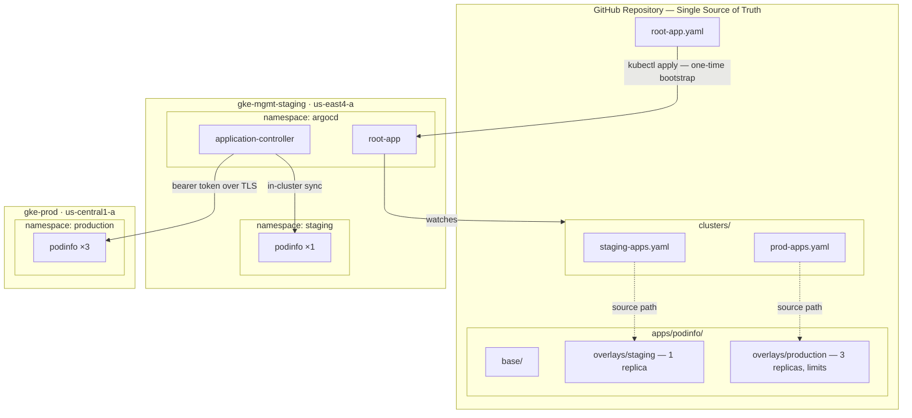

# Multi-Cluster GitOps Control Plane — ArgoCD App of Apps on GKE

A centralized GitOps control plane using ArgoCD on Google Kubernetes Engine. A single Git repository drives declarative workload deployment across two GKE clusters using the "App of Apps" pattern, Kustomize overlays for environment promotion, and automated drift reconciliation with self-healing.

## Architecture



**Data flow:** `root-app.yaml` is the only manually applied manifest. It watches `clusters/` for child Application definitions. Each child points to a Kustomize overlay path and a target cluster. The `application-controller` syncs rendered manifests to the correct destination — locally for staging, over an authenticated TLS connection for production.

## Repository Structure
gitops-argocd-lab/

├── root-app.yaml                        # Root ArgoCD Application (bootstrap entry point)

├── clusters/

│   ├── staging-apps.yaml                # Child app → in-cluster staging

│   └── prod-apps.yaml                   # Child app → remote gke-prod

├── apps/

│   └── podinfo/

│       ├── base/

│       │   ├── deployment.yaml          # Canonical workload manifest

│       │   └── kustomization.yaml

│       └── overlays/

│           ├── staging/

│           │   ├── kustomization.yaml   # 1 replica, staging namespace

│           │   └── replica-patch.yaml

│           └── production/

│               ├── kustomization.yaml   # 3 replicas, resource limits, production namespace

│               └── replica-patch.yaml

└── README.md

## Cluster Topology

| Property | gke-mgmt-staging | gke-prod |
|---|---|---|
| **Zone** | `us-east4-a` | `us-central1-a` |
| **Role** | ArgoCD control plane + staging workloads | Remote production target |
| **Machine Type** | `e2-medium` (2 vCPU, 4 GB) | `e2-medium` (2 vCPU, 4 GB) |
| **Nodes** | 2 | 2 |
| **Workloads** | ArgoCD (7 pods), podinfo ×1 | podinfo ×3 |

## Technologies

- **ArgoCD v2.14.11** — GitOps continuous delivery controller
- **Google Kubernetes Engine** — Managed Kubernetes (K8s 1.35)
- **Kustomize** — Base/overlay manifest management without templating
- **App of Apps pattern** — Hierarchical Application management for multi-cluster orchestration

## Bootstrap

### 1. Enable GCP APIs

```bash
gcloud services enable compute.googleapis.com container.googleapis.com \
  --project <PROJECT_ID>
```

### 2. Provision GKE Clusters

```bash
gcloud container clusters create gke-mgmt-staging \
  --zone us-east4-a \
  --machine-type e2-medium \
  --num-nodes 2 \
  --disk-size 30 \
  --project <PROJECT_ID>

gcloud container clusters create gke-prod \
  --zone us-central1-a \
  --machine-type e2-medium \
  --num-nodes 2 \
  --disk-size 30 \
  --project <PROJECT_ID>
```

### 3. Rename Kubeconfig Contexts

```bash
kubectl config rename-context \
  gke_<PROJECT_ID>_us-east4-a_gke-mgmt-staging mgmt-staging

kubectl config rename-context \
  gke_<PROJECT_ID>_us-central1-a_gke-prod prod
```

### 4. Install ArgoCD on Management Cluster

```bash
kubectl config use-context mgmt-staging
kubectl create namespace argocd
kubectl apply -n argocd \
  -f https://raw.githubusercontent.com/argoproj/argo-cd/v2.14.11/manifests/install.yaml
```

### 5. Access ArgoCD

```bash
argocd admin initial-password -n argocd
kubectl port-forward svc/argocd-server -n argocd 8080:443 &
argocd login localhost:8080 --username admin --password <PASSWORD> --insecure
```

### 6. Register Remote Production Cluster

```bash
argocd cluster add prod --name gke-prod -y
```

This creates a ServiceAccount with `cluster-admin` privileges on `gke-prod` and stores the bearer token as a Secret in the `argocd` namespace on the management cluster.

### 7. Deploy the App of Apps

```bash
kubectl apply -f root-app.yaml
argocd app sync root-app
```

## Verification

```bash
# All three applications: Synced and Healthy
argocd app list

# Both clusters: Successful connection
argocd cluster list

# Staging: 1 pod running
kubectl get pods -n staging --context mgmt-staging

# Production: 3 pods running
kubectl get pods -n production --context prod
```

## Self-Healing Demonstration

Both child applications are configured with `automated: { prune: true, selfHeal: true }`. To test:

```bash
# Manually delete the production deployment
kubectl delete deployment podinfo -n production --context prod

# Watch ArgoCD detect drift and recreate within seconds
kubectl get pods -n production --context prod -w
```

ArgoCD's application-controller uses Kubernetes informers (watch events) for near-instant drift detection. The cluster is effectively read-only — Git is the only valid mutation path.

## Teardown

```bash
gcloud container clusters delete gke-prod \
  --zone us-central1-a --project <PROJECT_ID> --quiet

gcloud container clusters delete gke-mgmt-staging \
  --zone us-east4-a --project <PROJECT_ID> --quiet

gcloud container clusters list --project <PROJECT_ID>
```

## Design Decisions

| Decision | Rationale |
|---|---|
| Zonal clusters (not regional) | 2 nodes vs. 6 — minimizes cost while demonstrating full multi-cluster architecture |
| `e2-medium` instances | Smallest type supporting ArgoCD's 7-pod control plane alongside workloads |
| Separate regions | Forces cross-network API authentication — mirrors enterprise multi-cluster topology |
| Manifest install (not Helm) | Single `kubectl apply` with pinned version; Helm preferred in production for tunable values |
| Port-forward (not Ingress) | Zero cost, zero attack surface for lab access; production uses Ingress + cert-manager |
| Root app manual sync | Deliberate gate for adding/removing entire applications from the hierarchy |
| Child apps auto-sync + self-heal | Enforces Git as sole mutation path; cluster drift corrected in seconds |
| Kustomize (not Helm) | Environment promotion is a Git diff — no chart versioning or template variables needed |
